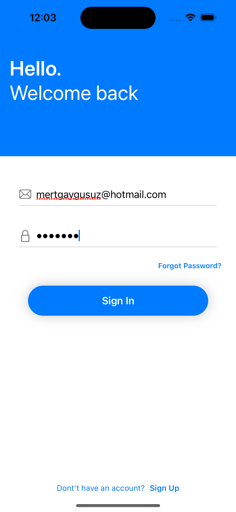
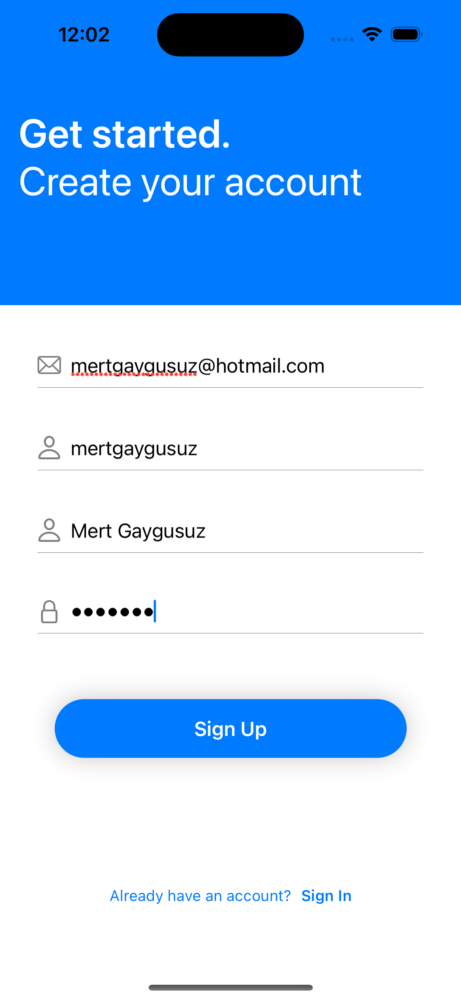
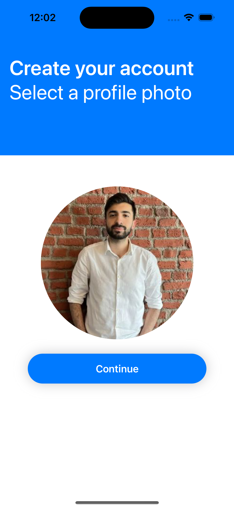
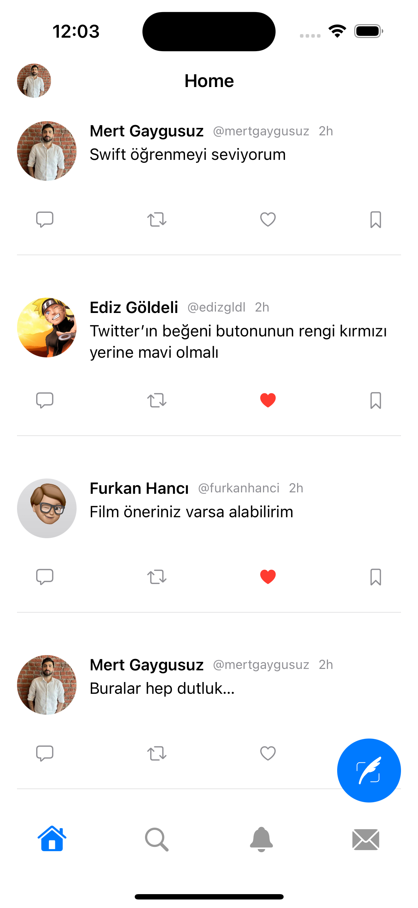
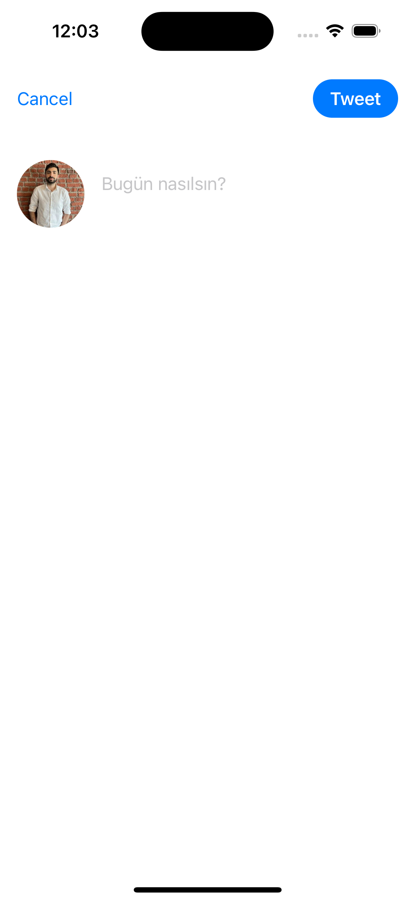
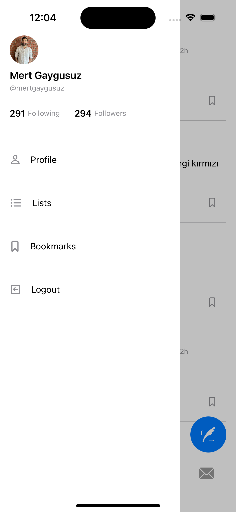
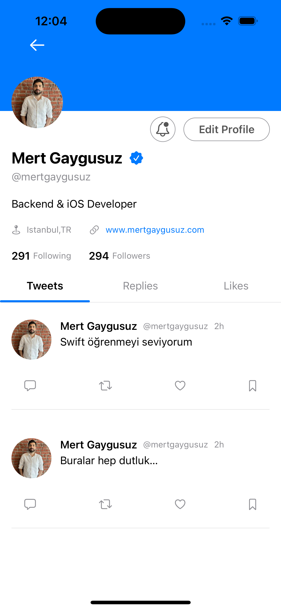
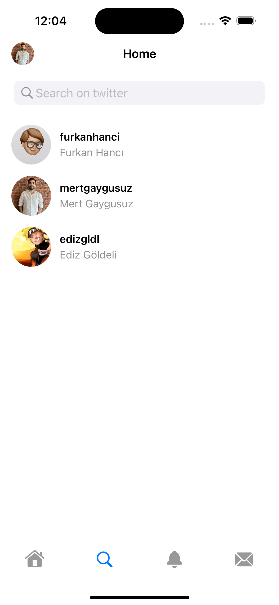
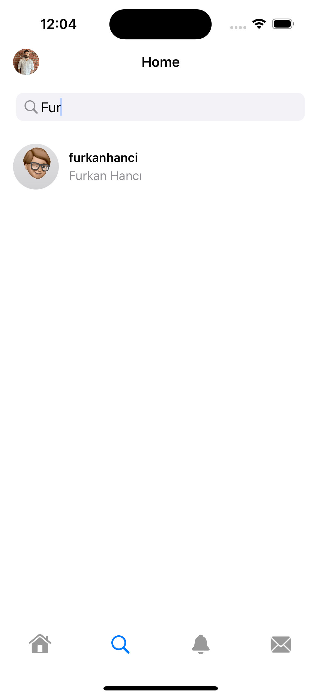

# TwitterClone

It was a project I did to experience SwiftUI.
An application with some functions of Twitter.

# Features
* MVVM Architecture
* Registration and login feature
* Users can tweet and like other tweets
* You can view other users on the Explorer page and find the user you want by filtering.
* In the user profile, you can see the tweets he shared and the tweets he liked in separate tabs.

# Pods

```yaml
  pod 'KingFisher'
```

# Packages

```yaml
  package 'Firebase'
```

# Screens
   
   
    
  
